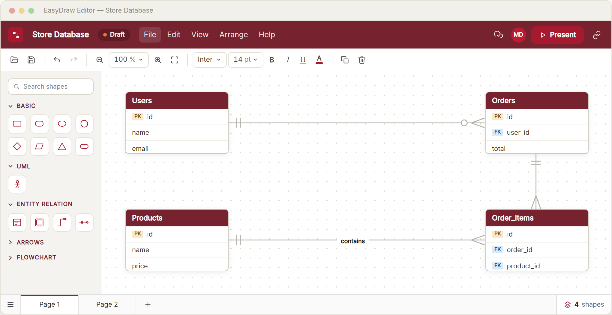

<h1 align="center">EasyDraw</h1>

  Design ERDs, UML and flowcharts in your browser — free, no install.

  <a href="https://easydraw.net"><b>🌐 easydraw.net</b></a>
  &nbsp;·&nbsp;
  

<!-- Add a screenshot of the editor here (docs/screenshot.png) and uncomment:

-->

## 🌟 Highlights

- 🎓 **Notation that matches your coursework** — crow's foot cardinality, weak entities and relationship diamonds are first-class shapes, not something you assemble out of rectangles and lines
- 💸 **Actually free** — no document cap, no trial, no paid tier waiting to interrupt you
- ☁️ **Saves as you draw** — pick up your diagram on any machine, right where you left it
- 📄 **Multi-page documents** — keep a whole assignment in one file, one tab per diagram
- 📤 **Export anywhere** — PNG, JPEG and PDF for your report; `.easydraw` to keep a backup
- 🖥️ **Nothing to install** — it runs in the browser, including on a modest laptop

## ℹ️ Overview

EasyDraw is a diagramming tool built for the diagrams students and developers
actually have to produce: entity-relationship diagrams, UML, flowcharts and
data-flow diagrams. Drag a shape onto the canvas, connect it, style it, and
export it — the whole loop stays in one browser tab.

Most diagramming tools are either general-purpose canvases that leave you
hand-building standard notation, or capable products that cap their free tier
and ask for a subscription right when an assignment is due. EasyDraw takes the
opposite position: the notation is built in, and the tool is free to use.

## 🚀 What you can do

**Draw** — A searchable shape library covering basic shapes, arrows,
flowcharts, entity-relationship, UML and network symbols. Drag from the sidebar
onto the canvas.

**Connect** — Connections route themselves around your shapes, and you can drag
any bend point to take a different path. Attach labels anywhere along a line,
and set ERD cardinality on either end.

**Style** — Fill, border, typography and effects for every shape; line style,
endings, colour and width for every connection. Hover a font or size to preview
it live on the selected shape before you commit.

**Organise** — Split a document into pages, then rename, duplicate or reorder
them from the tabs along the bottom.

**Present** — Hide the editor chrome and step through your pages full-screen,
using the arrow keys.

**Export** — PNG, JPEG or PDF for handing in, or `.easydraw` to keep your own
copy of the file.

## 💾 Your work is kept safe

Every change is saved to your account automatically — the indicator in the menu
bar tells you exactly when it lands. Diagrams are private to your account by
default, and you can mark each one as *draft*, *complete* or *archived* to keep
your dashboard tidy.

Sign in with an email address and password, or continue with Google.

## 🧱 Built with

**Frontend**

| Technology | What it does here |
| --- | --- |
| **Next.js 16** (App Router) | Ships the whole app as a static export — pages are prerendered files served straight from a CDN, so there is no server to wait on |
| **React 19** + **TypeScript** | Component model and type safety across the editor |
| **React Flow** (`@xyflow/react`) | The canvas engine: node rendering, panning, zooming and connection handles |
| **Zustand** | Editor state — the graph, document pages, undo/redo history and UI flags |
| **Tailwind CSS v4** | Styling, with the palette defined once as theme tokens |
| **html-to-image** + **jsPDF** | Rasterises the canvas for PNG/JPEG export and lays it out for PDF |

**Backend**

| Technology | What it does here |
| --- | --- |
| **NestJS 11** | REST API for accounts and diagrams |
| **PostgreSQL** + **Prisma 7** | Stores users and diagrams; each document is a single JSONB column, so a diagram saves and loads in one round trip |
| **Redis** (via Keyv) | Caches diagram lists so the dashboard stays fast |
| **JWT in an httpOnly cookie** | Session handling that JavaScript cannot read, which keeps tokens away from XSS |
| **Passport** + Google OAuth 2.0 | "Continue with Google" sign-in |
| **bcrypt** | Password hashing |
| **Helmet** + **Throttler** | Security headers and rate limiting on authentication routes |
| **class-validator** | Validates every request body before it reaches the database |
| **Pino** | Structured request logging |
| **Nodemailer** | Password-reset emails |
| **Swagger** | Generated API reference |

**Infrastructure**

| Technology | What it does here |
| --- | --- |
| **AWS Amplify Hosting** | Serves the static frontend over CloudFront |
| **AWS ECS** | Runs the API container behind a load balancer at `api.easydraw.net` |
| **AWS RDS** | Managed PostgreSQL |
| **Cloudflare** | DNS |
| **GitHub Actions** | Runs the test suite on every change and deploys the API |

### 📚 Deeper dives

The two halves of the project each have their own write-up:

- **[🎨 Client](client/README.md)** — how the editor is built: the three layers
  of document state, the shape registry, connection routing and export
- **[⚙️ Server](server/README.md)** — the API surface, data model, session
  handling and hardening

## ✍️ Author

Built by **David Nguyen**, a student at Macquarie University, out of a plain
frustration: drawing an ERD for a database assignment was slower than designing
the database itself. EasyDraw is the tool that should have existed then.

## 📬 Feedback

Found a bug, or something that should work differently? Email
**[support@easydraw.net](mailto:support@easydraw.net)** — real usage reports
are the main thing shaping what gets built next.

## 📄 License

EasyDraw is proprietary software. You are free to use the hosted service at
[easydraw.net](https://easydraw.net), and the diagrams you create there are
yours. The source code itself is not licensed for copying, modification or
redistribution — see [LICENSE](LICENSE) for the full terms.
