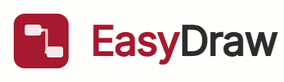
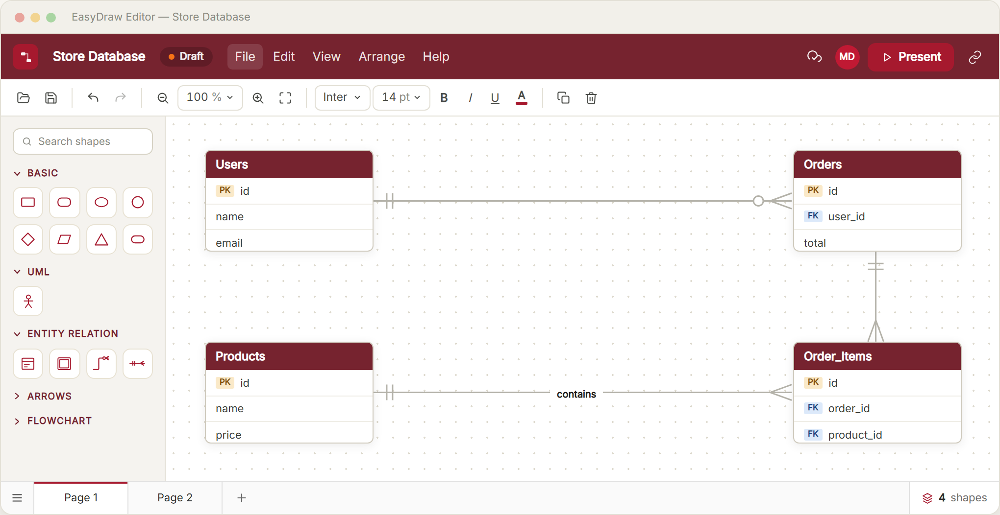

<h1 align="center">
  <picture>
    <source media="(prefers-color-scheme: dark)" srcset="docs/logo-dark.png">
    
  </picture>
</h1>

  Sketch an idea, turn it into your own diagram, and design it in 2D and 3D at the same time - in your browser, free, no install.

  <a href="https://easydraw.net"><b>🌐 easydraw.net</b></a>
  &nbsp;·&nbsp;
  

## 🌟 Highlights

- ✏️ **From sketch to diagram**: Draw the idea freehand on a whiteboard, and turn it into an editable diagram that is yours to refine
- 🧊 **2D and 3D, one design**: Every diagram has a live 3D view of the same content - change it in either view and the other follows instantly
- 🎯 **Edit where it makes sense**: Move, resize, rotate, connect and relabel in 2D or directly in 3D, with a single undo history
- 🧱 **Your own building blocks**: Private libraries for your images and for 3D objects you compose yourself
- ☁️ **Saves as you work**: Every change lands in your account automatically, on any machine
- 📤 **Export anywhere**: PNG, JPEG and PDF from either view, `.easydraw` for a backup, and import from draw.io or Visio/Lucidchart
- 🖥️ **Nothing to install**: It all runs in the browser; the 3D view renders live with WebGL

## ℹ️ Overview

EasyDraw is a personal visual workspace for turning ideas into designs. Start
with a rough sketch on the whiteboard, or go straight to the diagram canvas.
Either way, EasyDraw keeps the flat plan and its three-dimensional form in
step: what you draw on the page and the space it describes are always the same
design.

Design tools usually make you choose. A 2D diagramming tool shows how things
relate but hides depth, scale and fit; a 3D package shows the space but is slow
to sketch in, and asks for manual modelling before an idea has even been
agreed. EasyDraw sits between the two: sketch quickly in 2D, and see the spatial
result in 3D immediately, without waiting for a render.

## 💡 Why design in 2D and 3D at once

- ⚡ **Try and approve ideas faster**: Draw or edit on the 2D plane and see the
  matching 3D volume, viewpoint and lighting straight away. A design decision
  can be made on the spot, with no waiting for frames to render.
- 📐 **Catch scale and spatial mistakes early**: Flat drawings easily mislead
  about depth and how things will fit in reality. Orbiting a live 3D model shows
  clashes of space, structure or human scale while the design is still a sketch.
- 🤝 **Communicate with clients and stakeholders**: People outside engineering
  often struggle to picture a product from a plan. A live 3D view they can
  explore - rotate it, recolour it, change a detail - during the meeting itself
  gets everyone to a decision sooner.
- 💰 **Spend less before production**: Fewer hours and fewer people go into
  manual 3D modelling at the concept stage, so the effort goes where it counts:
  refining and finishing the design.

## 🚀 What you can do

**Sketch**: A whiteboard with the tools you expect from a paint program -
pencil, brush, airbrush, eraser, fill, colour picker, lines, curves, shapes,
text, selections and pasted images - with a mouse or a stylus.

**Turn the sketch into a diagram**: Send the drawing, with an optional note
about what you meant, and get a preview of an editable diagram. Refine it with
feedback, then create the diagram from exactly the preview you approved. The new
diagram stays linked to the whiteboard it came from.

**Draw in 2D**: A searchable shape library covering basic shapes, arrows,
flowcharts, entity-relationship and UML. Connections route themselves around
your shapes, bend points can be dragged, labels sit anywhere along a line, and
ERD cardinality is set on either end.

**Design in 3D**: Switch the same diagram to 3D. Orbit, pan and zoom; jump to a
Fit, Isometric, Top or Front view; lay the scene on the floor or stand it
upright; toggle the grid. Move, resize and rotate objects, raise them and give
them depth, connect them and edit their labels in 3D - the 2D plan follows.
Camera and spatial layout are saved with each page.

**Build with objects**: Compose reusable 3D objects from simple parts and keep
them, alongside your own image nodes, in private libraries. Open the Data
Centre sample from the dashboard to see a complete 2D and 3D layout.

**Organise**: Split a document into pages; keep diagrams and whiteboards apart
on the dashboard, with thumbnails, categories, templates and a *draft*,
*complete* or *archived* status.

**Present**: Hide the editor chrome and step through your pages full-screen,
in 2D or 3D.

**Import and export**: Open draw.io and Visio/Lucidchart (VSDX) files. Export
PNG, JPEG or PDF from either view, or `.easydraw` to keep your own copy.

## 💾 Your work is kept safe

Every change is saved to your account automatically - the indicator in the menu
bar tells you exactly when it lands, and leaving the editor while a save is
still in flight never drops your latest edit. Diagrams and whiteboards are
private to your account.

Sign in with an email address and password, or continue with Google. From
settings you can see every device signed in to your account and sign any of
them out.

## 🧱 Built with

**Frontend**

| Technology | What it does here |
| --- | --- |
| **Next.js 16** (App Router) | Ships the whole app as a static export - pages are prerendered files served straight from a CDN, so there is no server to wait on |
| **React 19** + **TypeScript** | Component model and type safety across the editors |
| **React Flow** (`@xyflow/react`) | The 2D canvas engine: node rendering, panning, zooming and connection handles |
| **Three.js** + **React Three Fiber** + **Drei** | The live 3D view: WebGL rendering, lighting and shadows, camera controls and in-scene editing handles |
| **Zustand** | Editor state - one graph that feeds both views, document pages, undo/redo history and UI flags |
| **HTML Canvas** | The whiteboard's raster paint engine |
| **Tailwind CSS v4** | Styling, with the palette defined once as theme tokens |
| **html-to-image** + **jsPDF** | Rasterises the canvas for PNG/JPEG export and lays it out for PDF |
| **Vitest** | Unit tests for stores, document models and the editors' save logic |

**Shared packages** (npm workspace)

| Package | What it does here |
| --- | --- |
| `@easydraw/diagram-schema` | Versioned diagram and 3D document contracts, validated identically in the browser and the API |
| `@easydraw/diagram-import` | Converts draw.io and VSDX files into EasyDraw documents |
| `@easydraw/objects-3d` | Starter set of 3D object recipes used by the samples |
| `@easydraw/pack-whiteboard` | The whiteboard document format |
| `@easydraw/shared-types` | Small framework-free primitives shared by everything above |

**Backend**

| Technology | What it does here |
| --- | --- |
| **NestJS 11** | REST API for accounts, documents, libraries and previews |
| **PostgreSQL 16** + **Prisma 7** | Stores accounts, documents and libraries; each document is a single JSONB column, so it saves and loads in one round trip |
| **Database sessions in an httpOnly cookie** | Random session tokens stored only as hashes, so any device can be signed out on its own |
| **Passport** + Google OAuth 2.0 | "Continue with Google" sign-in |
| **bcrypt** | Password hashing |
| **OpenAI** (server-side) | Sketch-to-diagram previews; the key never reaches the browser |
| **Amazon S3** + **sharp** | Private storage for uploaded images, validated and re-encoded before use |
| **Redis** (via Keyv) | Optional cache for dashboard listings |
| **Helmet**, **Throttler** + an Origin guard | Security headers, rate limiting and cross-site request protection |
| **class-validator** | Validates every request body before it reaches the database |
| **Pino** | Structured request logging |
| **Nodemailer** | Verification and password-reset emails |
| **Jest** + **Supertest** | Unit tests and end-to-end tests against a real PostgreSQL |

**Infrastructure**

| Technology | What it does here |
| --- | --- |
| **AWS Amplify Hosting** | Builds the static frontend and serves it over CloudFront |
| **AWS ECS** (Fargate) | Runs the API container behind a load balancer at `api.easydraw.net`, with canary deployments that roll back on failure |
| **AWS RDS** | Managed PostgreSQL, reached over certificate-verified TLS |
| **Amazon S3** + **ECR** | Private image storage, and the API images built for every release |
| **Docker** | One image definition for the API and its database migrations |
| **Cloudflare** | DNS |
| **GitHub Actions** | Lint, tests, dependency audit and an image smoke test on every change; reviewed, manual API releases that migrate the database first |

### 📚 Deeper dives

The two halves of the project each have their own write-up:

- **[🎨 Client](client/README.md)**: how one graph drives both the 2D and 3D
  views, the whiteboard engine, the sketch-to-diagram flow, and how saving works
- **[⚙️ Server](server/README.md)**: the API surface, data model, sessions,
  hardening, AI previews and how releases reach production

## ✍️ Author

Built by **David Nguyen**, a student at Macquarie University, out of a plain
frustration: drawing an ERD for a database assignment was slower than designing
the database itself. EasyDraw is the tool that should have existed then.

## 📬 Feedback

Found a bug, or something that should work differently? Email
**[support@easydraw.net](mailto:support@easydraw.net)**: Real usage reports
are the main thing shaping what gets built next.

## 🙏 Acknowledgements

EasyDraw stands on a lot of open-source work. Particular thanks to:

- **[React Flow](https://reactflow.dev)** (MIT): the canvas primitives the
  2D editor is built on
- **[three.js](https://threejs.org)**, **[React Three Fiber](https://r3f.docs.pmnd.rs)**
  and **[Drei](https://github.com/pmndrs/drei)** (MIT): the 3D view
- **[Next.js](https://nextjs.org)** and **[React](https://react.dev)** (MIT):
  the application framework
- **[NestJS](https://nestjs.com)** (MIT) and **[Prisma](https://prisma.io)**
  (Apache-2.0): the API and its database layer
- **[Tailwind CSS](https://tailwindcss.com)** (MIT), **[Zustand](https://zustand.docs.pmnd.rs)**
  (MIT) and **[Lucide](https://lucide.dev)** (ISC): styling, state and icons
- **[html-to-image](https://github.com/bubkoo/html-to-image)** and
  **[jsPDF](https://github.com/parallax/jsPDF)** (MIT): image and PDF export
- **[sharp](https://sharp.pixelplumbing.com)** (Apache-2.0): image processing
- **[Helmet](https://helmetjs.github.io)**, **[Passport](https://www.passportjs.org)**,
  **[Pino](https://getpino.io)** (MIT) and **[bcrypt.js](https://github.com/dcodeIO/bcrypt.js)**
  (BSD-3-Clause): security, sign-in and logging

The typefaces offered in the editor are bundled under their own licences —
[the font inventory](client/public/fonts/README.md) lists each one.

## 📄 License

EasyDraw is proprietary software. You are free to use the hosted service at
[easydraw.net](https://easydraw.net), and the diagrams you create there are
yours. The source code itself is not licensed for copying, modification or
redistribution - see [LICENSE](LICENSE) for the full terms.
